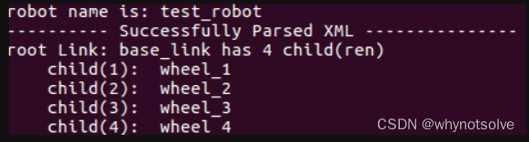

### ROS机器人小车建模仿真与SLAM

实验要求：

一 . 参考网上资料，在ROS中完成一个机器小车的模型创建，传感器配置，仿真环境的设置，并控制机器小车进行运动。

urdf模型搭建参考：https://www.cnblogs.com/IT-cute/p/12990162.html

#### 1. URDF文件简介（unified Robot Description Format统一机器人描述性格式）

* **URDF描述规格：**

    用一个文件描述一个机器人模型

    文件的后缀为.urdf

    文件的内容格式为XML格式

    XML根节点为robot

*

  ###### 各个语句含义

    inertial 定义惯性
    geometry 用来描述模块的形状和大小
    origin 用来描述模块的位置；
    material 并且设置 color 上色
    material 指定颜色rgb和透明度a. 它们取值范围都是[０,1] 区间2

#### 2.建模

* 创建简单的机器人模型-四轮小车

      /安装urdf_tutorial包
      sudo apt-get install ros-kinetic-urdf-tutorial

      /创建ros工作空间
      mkdir myrobot/src -p
      cd myrobot/src
      catkin_init_workspace
      cd ..
      catkin_make

      /在myboot.urdf文件里面填入以下代码
      <robot name="test_robot">  
        <link name="base_link">  
          <visual>  
             <geometry>  
               <box size="0.2 .3 .1"/>  
             </geometry>  
             <origin rpy="0 0 0" xyz="0 0 0.05"/>  
             <material name="white">  
               <color rgba="1 1 1 1"/>  
             </material>  
          </visual>  
        </link>  
        
        <link name="wheel_1">  
          <visual>  
            <geometry>  
              <cylinder length="0.05" radius="0.05"/>  
            </geometry>  
            <origin rpy="0 1.5 0" xyz="0.1 0.1 0"/>  
            <material name="black">  
              <color rgba="0 0 0 1"/>  
            </material>  
          </visual>  
        </link>  
        
        <link name="wheel_2">  
          <visual>  
            <geometry>  
              <cylinder length="0.05" radius="0.05"/>  
            </geometry>  
            <origin rpy="0 1.5 0" xyz="-0.1 0.1 0"/>  
            <material name="black"/>  
          </visual>  
        </link>  
        
        <link name="wheel_3">  
          <visual>  
            <geometry>  
              <cylinder length="0.05" radius="0.05"/>  
            </geometry>  
            <origin rpy="0 1.5 0" xyz="0.1 -0.1 0"/>  
            <material name="black"/>  
          </visual>  
        </link>  
        
        <link name="wheel_4">  
          <visual>  
            <geometry>  
              <cylinder length="0.05" radius="0.05"/>  
            </geometry>  
            <origin rpy="0 1.5 0" xyz="-0.1 -0.1 0"/>  
            <material name="black"/>  
          </visual>  
        </link>  
        
        <joint name="joint_base_wheel1" type="fixed">  
          <parent link="base_link"/>  
          <child link="wheel_1"/>  
        </joint>  
        
        <joint name="joint_base_wheel2" type="fixed">  
          <parent link="base_link"/>  
          <child link="wheel_2"/>  
        </joint>  
        
        <joint name="joint_base_wheel3" type="fixed">  
          <parent link="base_link"/>  
          <child link="wheel_3"/>  
        </joint>  
        
        <joint name="joint_base_wheel4" type="fixed">  
          <parent link="base_link"/>  
          <child link="wheel_4"/>  
        </joint>  
      </robot> 

  如下显示即为成功：

  

#### 3.书写launch文件

在launch文件夹下建立car01.launch文件，里面输入如下代码：

    <!-- -->
    <launch>
            <param name="robot_description"
            textfile="$(find little_car)/urdf/car01.urdf"/>   // 这一行需要更改为自己urdf文件所在位置
            
            <node name="robot_state_publisher" pkg="robot_state_publisher" type="state_publisher"/>
            
    		<node name="rviz" pkg="rviz" type="rviz" respawn="false" output="screen"/>
    </launch>

#### 4.启动launch

    roslaunch smartcar car01.launch

###### 最后： 在rviz里面将Fixed Frame 改为: base_link，并点击Add添加 Robotmodel 即可查看自己构建的模型

关于SLAM的实现，它通常依赖于多种传感器数据，如激光雷达或摄像头等。这些传感器能够获取环境的几何信息或图像信息，为机器人的定位和地图构建提供数据支持。

在基于激光的SLAM方法中，激光雷达被用于获取环境的点云数据。通过对点云数据的处理和分析，机器人能够识别出环境中的障碍物、墙壁等特征，并据此进行定位和地图构建。

而在基于视觉的SLAM方法中，摄像头则扮演着重要角色。通过图像处理和计算机视觉算法，机器人可以从图像中提取特征点，并利用这些特征点之间的匹配关系来计算相机的运动和地图的构建。这种方法对光照条件和图像质量有一定的要求，但在光照条件良好的情况下，能够实现高精度的定位和地图构建。

此外，还有一些算法如粒子滤波定位技术、gmapping等，也被广泛应用于SLAM中。这些算法能够根据机器人的运动模型和传感器的反馈信息，对机器人在地图上的位置进行估计，并不断优化和更新地图。

SLAM算法可以根据不同的标准进行分类。以下是一些常见的分类方式：

1. **基于数据类型**：

   * **基于滤波器的SLAM**：这类算法使用概率滤波器（如扩展卡尔曼滤波器、粒子滤波器等）来进行位置估计和地图更新。
   * **基于优化的SLAM**：这类算法则使用非线性优化方法（如图优化、BA优化等）来进行位置估计和地图更新。
2. **基于传感器类型**：

   * **基于视觉的SLAM算法**：如ORB-SLAM、LSD-SLAM、PTAM、SVO、DTAM等。这些算法主要依赖摄像头作为感知设备。例如，ORB-SLAM是一种快速、鲁棒的2D和3D SLAM算法；LSD-SLAM是一种单目摄像头的SLAM算法；PTAM是一种实时、鲁棒的单目摄像头SLAM算法；SVO是一种适用于小型移动机器人的单目视觉SLAM算法；DTAM是一种使用深度图像的SLAM算法。
   * **基于组合传感器的SLAM算法**：如Rovio、OKVIS、LSD-SLAM2、VINS-Mono、VINS-Fusion等。这些算法使用多种传感器（如摄像头、IMU、激光雷达等）来进行SLAM，利用多种传感器的优势来提高SLAM的精度和鲁棒性。

动机器人的单目视觉SLAM算法；DTAM是一种使用深度图像的SLAM算法。

* **基于组合传感器的SLAM算法**：如Rovio、OKVIS、LSD-SLAM2、VINS-Mono、VINS-Fusion等。这些算法使用多种传感器（如摄像头、IMU、激光雷达等）来进行SLAM，利用多种传感器的优势来提高SLAM的精度和鲁棒性。
