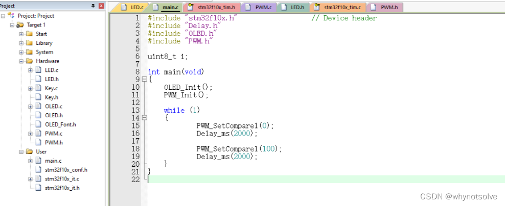

---

第1周---ROS1.0环境安装与配置
------------------------------

实验要求：

### 1.在Ubuntu16/18/20系统中，安装对应版本的ROS1.0软件. 注意记录和分析所遇到的各式问题和解决措施

### 2.熟悉ROS基本命令，并运行小海龟demo例子，通过键盘控制小海龟运动。同时用话题查看器查看两个node之间的消息传递

### 3.用C++或python写一个程序，控制小海龟走一个标准的圆形；成功后，再采用两台电脑，重新进行远程小海龟实验

#### 1、什么是ROS系统

ROS（Robotic Operating System）是一种开源的机器人操作系统，它提供了一系列的软件库和工具，用于帮助开发机器人应用程序。ROS并不是一个传统意义上的操作系统，而是一个运行在类Unix系统（如Linux）上的软件平台，旨在简化和加速机器人软件开发过程。ROS提供了诸如硬件抽象、设备驱动、通讯中间件、传感器处理等功能，使开发人员可以更方便地构建复杂的机器人控制系统。ROS已经广泛应用于学术研究和工业领域中的各种机器人项目中。

#### 2、为什么需要学习ROS系统

1. **模块化设计**：ROS系统是一种高度模块化的框架，允许开发者将复杂的系统拆分成多个独立的、可复用的组件，即节点（Nodes）。这对于我们来说非常有价值，因为嵌入式系统的开发往往也涉及到硬件和软件的模块化设计。通过学习ROS，学生可以更好地理解和应用模块化设计的思想。
2. **实时性能**：ROS系统被设计为实时性能优秀的系统，适用于需要快速响应和处理大量数据的场景。这对于我们来说非常重要，因为嵌入式系统通常需要在有限的硬件资源下实现实时性能。学习ROS可以帮助学生掌握实时系统的设计和优化技巧。
3. **语言独立性**：ROS系统支持多种编程语言，如C++、Python等，使得开发者可以根据自己的需求选择最合适的编程语言。这对我们来说是一个很好的学习机会，可以让他们熟悉和掌握多种编程语言，提高编程能力和灵活性。
4. **社区支持**：ROS系统拥有庞大的用户社区和丰富的开源资源，这对于我们来说非常有帮助。他们可以通过社区交流和学习，共享经验，解决问题，也可以利用开源资源来加速自己的开发过程。

#### 3、为什么不同版本环境下的Ubuntu需要下载不同版本的ROS 1.0系统

ROS和Ubuntu之间存在版本对应关系。

为了确保ROS在Ubuntu上的稳定运行和兼容性，ROS的开发者会根据Ubuntu的版本发布相应的ROS版本。这些版本通常会在Ubuntu发布新版本后的一段时间内推出，以确保与新的Ubuntu版本兼容。

**Ubuntu不同版本需要下载不同版本的ROS是为了确保ROS在Ubuntu上的稳定运行和兼容性，并充分利用最新功能和优化。**

|  Ubuntu 版本   |   ROS 1.0 推荐安装版本    |
|--------------|---------------------|
| Ubuntu 14.04 | ROS Indigo Igloo    |
| Ubuntu 16.04 | ROS Kinetic Kame    |
| Ubuntu 18.04 | ROS Melodic Morenia |
| Ubuntu 20.04 | ROS Noetic          |

ROS（Robot Operating System）支持多个版本的Ubuntu操作系统。具体来说，ROS1支持Ubuntu 14.04（Indigo版本）、Ubuntu 16.04（Kinetic版本）和Ubuntu 18.04（Melodic版本）。其中，Ubuntu 14.04的截止支持时间是2019年4月，Ubuntu 16.04的截止支持时间是2021年4月，而Ubuntu 18.04的截止支持时间是2023年4月。

另外，ROS2也支持Ubuntu，包括Ubuntu 20.04和预计支持的Ubuntu 22.04。然而，需要注意的是，ROS1的最后一个版本Noetic Ninjemys已经不再支持Ubuntu 22.04，因此，对于需要在Ubuntu 22.04上运行ROS的用户，应考虑使用ROS2。

**这里介绍Ubuntu18.04 安装ROS 1.0**

#### 4、为什么需要软件源换源

1. **下载速度**：Ubuntu默认的官方软件源可能位于国外，因此在国内访问时可能会遇到速度较慢的问题。更换为国内的软件源可以显著提高软件包的下载速度，加快软件安装和更新的过程。

2. **软件包版本**：不同的软件源可能提供不同版本的软件包，有些软件源可能提供更新或更适合特定需求的软件包版本。更换软件源可以让我们选择更符合自己需求的软件包版本。

3. **适应网络环境**：在某些情况下，由于网络限制或防火墙等原因，访问国外软件源可能会受到限制。更换为国内软件源可以绕过这些限制，使软件安装和更新更加顺畅。

   **在Ubuntu系统中，`/etc/apt/sources.list` 文件确实包含了软件包的镜像源信息，而 `apt` 是用于管理软件包的命令行工具。在修改任何系统配置文件之前，进行备份是一个很好的做法，以便在出现问题时能够恢复到原始状态。**

   这里使用清华源：

       deb http://mirrors.tuna.tsinghua.edu.cn/ubuntu/ focal main restricted
       deb http://mirrors.tuna.tsinghua.edu.cn/ubuntu/ focal-updates main restricted
       deb http://mirrors.tuna.tsinghua.edu.cn/ubuntu/ focal universe
       deb http://mirrors.tuna.tsinghua.edu.cn/ubuntu/ focal-updates universe
       deb http://mirrors.tuna.tsinghua.edu.cn/ubuntu/ focal multiverse
       deb http://mirrors.tuna.tsinghua.edu.cn/ubuntu/ focal-updates multiverse
       deb http://mirrors.tuna.tsinghua.edu.cn/ubuntu/ focal-backports main restricted universe multiverse
       deb http://mirrors.tuna.tsinghua.edu.cn/ubuntu/ focal-security main restricted
       deb http://mirrors.tuna.tsinghua.edu.cn/ubuntu/ focal-security universe
       deb http://mirrors.tuna.tsinghua.edu.cn/ubuntu/ focal-security multiverse

#### 5、安装ROS

   在终端输入以下命令  
   添加ros软件源

       sudo sh -c '. /etc/lsb-release && echo "deb http://mirrors.ustc.edu.cn/ros/ubuntu/ $DISTRIB_CODENAME main" > /etc/apt/sources.list.d/ros-latest.list'

   添加密钥

       sudo apt-key adv --keyserver 'hkp://keyserver.ubuntu.com:80' --recv-key C1CF6E31E6BADE8868B172B4F42ED6FBAB17C654

   更新软件源

       sudo apt-get update

   安装ROS Noetic

       sudo apt install ros-noetic-desktop-full

   初始化 ROS

       sudo rosdep init

   设置环境变量  
   这里根据系统版本的不同，可以将nortic更换为kinetic或者melodic

       echo "source /opt/ros/noetic/setup.bash" >> ~/.bashrc

   使环境变量生效

       source ~/.bashrc

   安装rosinstall

       sudo apt install python3-rosinstall python3-rosinstall-generator python3-wstool

### 2.熟悉ROS基本命令，并运行小海龟demo例子，通过键盘控制小海龟运动。同时用话题查看器查看两个node之间的消息传递

   打开第一个终端

       ros2 run turtlesim turtlesim_node

   第二个终端输入

       ros2 run turtlesim turtle_teleop_key

   
