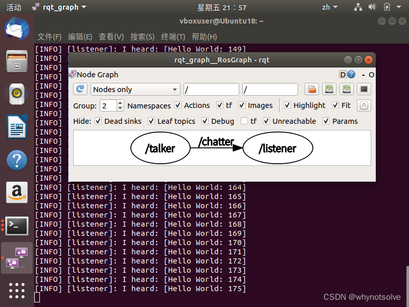
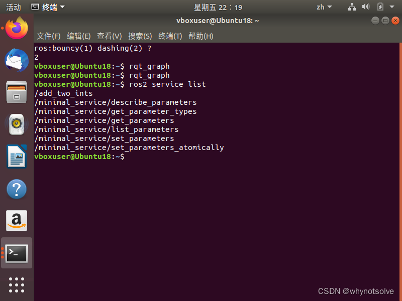
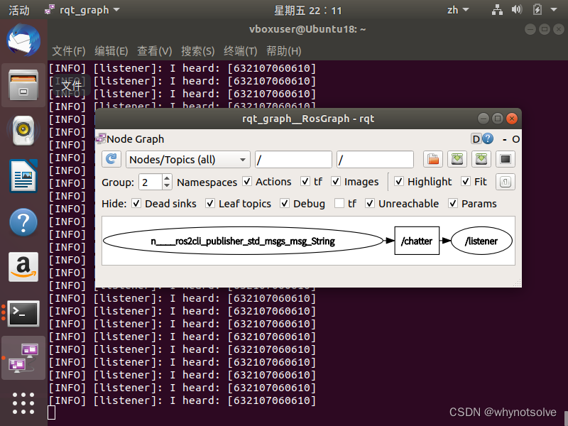

---
 

#### 文章目录

- [第2周--ROS通信编程](#2ros_1第2周--ros通信编程)
  - [一、按照课件内容，分别完成话题、服务模式的ROS示例程序，并实践练习；](#ros_5一按照课件内容分别完成话题服务模式的ros示例程序并实践练习)
    - [话题模式：](#_7话题模式)
    - [{服务模式：](#_95服务模式)
  - [二、练习ROS动作编程：客户端发送一个运动坐标，模拟机器人运动到目标位置的过程。包括服务端和客户端的代码实现，要求带有实时位置反馈。同时注意学习cmakelists 的使用方法。](#roscmakelists__132二练习ros动作编程客户端发送一个运动坐标模拟机器人运动到目标位置的过程包括服务端和客户端的代码实现要求带有实时位置反馈同时注意学习cmakelists-的使用方法)
  - [三. 每一个程序背后都站着一堆优秀的代码库。通过学习opencv图像库编程，了解如何借助第三方库函数完成一个综合程序设计。](#_opencv_134三-每一个程序背后都站着一堆优秀的代码库通过学习opencv图像库编程了解如何借助第三方库函数完成一个综合程序设计)
    - [1. 编写一个打开图片进行特效显示的代码 test1.cpp（见opencv编程参考资料 ）； 注意gcc编译命令: gcc test1.cpp -o test1 `pkg-config --cflags --libs opencv` 请解释这条编译命令，它是如何获得opencv头文件、链接lib库文件的路径的？](#1__test1cppopencv__gcc_gcc_test1cpp_o_test1_pkgconfig_cflags_libs_opencv_opencvlib_1361-编写一个打开图片进行特效显示的代码-test1cpp见opencv编程参考资料--注意gcc编译命令-gcc-test1cpp--o-test1-pkg-config---cflags---libs-opencv-请解释这条编译命令它是如何获得opencv头文件链接lib库文件的路径的)
    - [2. 练习使用opencv库编写打开摄像头压缩视频的程序。参考示例代码1和示例代码2。并回答：](#2_opencv12_1482-练习使用opencv库编写打开摄像头压缩视频的程序参考示例代码1和示例代码2并回答)
    - [1）如果要求打开你硬盘上一个视频文件来播放，请问示例代码1第7行代码如何修改？](#117_1501如果要求打开你硬盘上一个视频文件来播放请问示例代码1第7行代码如何修改)
    - [2）在示例代码1第9行的while循环中，Mat是一个什么数据结构？ 为什么一定要加一句waitKey延时代码，删除它行不行？](#219whilemat_waitkey_1582在示例代码1第9行的while循环中mat是一个什么数据结构-为什么一定要加一句waitkey延时代码删除它行不行)
    - [3）示例代码1代码会在while循环中一直运行，你如果试图用鼠标关闭图像显示窗口，会发现始终关不掉。需要用键盘Ctrl+C 强制中断程序，非常不友好。如何改进？](#31whilectrlc__1663示例代码1代码会在while循环中一直运行你如果试图用鼠标关闭图像显示窗口会发现始终关不掉需要用键盘ctrlc-强制中断程序非常不友好如何改进)
  - [{#\_207}实验心得：](#_207实验心得)

 

第2周--ROS通信编程
---------------------

实验要求：

### 一、按照课件内容，分别完成话题、服务模式的ROS示例程序，并实践练习

#### 话题模式

    ros2 run demo_nodes_py listener
    ros2 run demo_nodes_cpp talker
    rqt_graph

1. **`ros2 run demo_nodes_py listener`**

   这个命令运行`demo_nodes_py`包中的`listener`节点。`demo_nodes_py`是一个包含Python编写的ROS 2示例节点的包，而`listener`节点通常用于订阅某个主题以接收消息。这个节点会等待并处理从其他节点（如`talker`节点）发送过来的消息。
2. **`ros2 run demo_nodes_cpp talker`**

   这个命令运行`demo_nodes_cpp`包中的`talker`节点。`demo_nodes_cpp`是一个包含C++编写的ROS 2示例节点的包，而`talker`节点是一个发布者节点，它会发布消息到某个主题。在这个例子中，`talker`节点很可能会发布一些消息，这些消息随后会被`listener`节点接收。
3. **`rqt_graph`**

   `rqt_graph`是一个ROS 2的可视化工具，用于显示当前运行的所有ROS 2节点和它们之间的通信关系。当你运行了这个命令，它会打开一个窗口，展示一个图，其中节点用方框表示，节点之间的消息传递用箭头表示。通过查看这个图，你可以更好地理解ROS 2系统中各个节点是如何相互通信的。

手动发布一个话题：

    ros2 topic pub /chatter std_msgs/msg/String 'data: "632107060610"

创建`workspace`工作空间、`example_topic_rclcpp`功能包和`topic_publisher_01.cpp`

    cd d2lros2/
    mkdir -p RCLCPP/workspace/src
    cd RCLCPP/workspace/src
    ros2 pkg create example_topic_rclcpp --build-type ament_cmake --dependencies rclcpp
    touch example_topic_rclcpp/src/topic_publisher_01.cpp

采用面向对象方式写一个节点

    #include "rclcpp/rclcpp.hpp"

    class TopicPublisher01 : public rclcpp::Node
    {
    public:
        // 构造函数,有一个参数为节点名称
        TopicPublisher01(std::string name) : Node(name)
        {
            RCLCPP_INFO(this->get_logger(), "%s节点已经启动.", name.c_str());
        }

    private:
        // 声明节点
    };

    int main(int argc, char **argv)
    {
        rclcpp::init(argc, argv);
        /*创建对应节点的共享指针对象*/
        auto node = std::make_shared<TopicPublisher01>("topic_publisher_01");
        /* 运行节点，并检测退出信号*/
        rclcpp::spin(node);
        rclcpp::shutdown();
        return 0;
    }

修改CMakeLists.txt

    add_executable(topic_publisher_01 src/topic_publisher_01.cpp)
    ament_target_dependencies(topic_publisher_01 rclcpp)

    install(TARGETS
      topic_publisher_01
      DESTINATION lib/${PROJECT_NAME}
    )

#### 服务模式

    ros2 run examples_rclpy_minimal_service service//启动一个服务
    ros2 service list//查看服务列表
    ros2 service call /add_two_ints example_interfaces/srv/AddTwoInts "{a: 5,b: 10}"//手动调用服务

在ROS 2中，服务（service）是一种允许节点之间进行同步通信的机制。节点可以调用一个服务，等待服务完成其任务，并返回结果。以下命令的解释：

1. `ros2 run examples_rclpy_minimal_service service`

   这个命令用于启动`examples_rclpy_minimal_service`包中的`service`节点。这个节点提供了一个服务，通常用于演示或测试目的。你需要确保`examples_rclpy_minimal_service`包已经安装在你的ROS 2工作空间中，并且你已经构建了这个工作空间。
2. `ros2 service list`

   这个命令用于列出当前运行的所有服务的列表。通过运行这个命令，你可以看到`service`节点提供的服务是否已成功注册到ROS 2网络中。
3. `ros2 service call /add_two_ints example_interfaces/srv/AddTwoInts "{a: 5,b: 10}"`

   这个命令用于调用名为`/add_two_ints`的服务。这个命令假定服务的数据类型为`example_interfaces/srv/AddTwoInts`，并且传递了一个JSON格式的消息，其中`a`的值为5，`b`的值为10。服务调用会等待服务节点处理这个请求，并返回结果。
   - `/add_two_ints` 是服务的名称。
   - `example_interfaces/srv/AddTwoInts` 是服务的消息类型，它定义了服务请求和响应的结构。
   - `"{a: 5,b: 10}"` 是服务请求的具体内容，按照JSON格式进行编码。

如果一切正常，`ros2 service call`命令应该会返回服务处理请求后的结果。在这个例子中，如果服务的功能是加法，那么你应该会看到返回的结果为15（5加10）。

### 二、练习ROS动作编程：客户端发送一个运动坐标，模拟机器人运动到目标位置的过程。包括服务端和客户端的代码实现，要求带有实时位置反馈。同时注意学习cmakelists 的使用方法

### 三. 每一个程序背后都站着一堆优秀的代码库。通过学习opencv图像库编程，了解如何借助第三方库函数完成一个综合程序设计

#### 1. 编写一个打开图片进行特效显示的代码 test1.cpp（见opencv编程参考资料 ）； 注意gcc编译命令: gcc test1.cpp -o test1 `pkg-config --cflags --libs opencv` 请解释这条编译命令，它是如何获得opencv头文件、链接lib库文件的路径的？

    gcc test1.cpp -o test1: 这部分命令使用 gcc 编译器编译源文件 test1.cpp，并将生成的可执行文件命名为 test1。这部分命令告诉编译器要编译源文件并生成可执行文件。

    pkg-config --cflags --libs opencv: 这部分命令使用 pkg-config 工具来获取 OpenCV 库的编译选项。--cflags 选项用于获取包含 OpenCV 头文件的目录路径，--libs 选项用于获取链接 OpenCV 库文件的路径。这些选项告诉编译器在编译和链接过程中需要包含哪些头文件和链接哪些库文件。

    通过将这些选项传递给 gcc 编译器，它就能够知道在编译和链接过程中需要包含哪些头文件和链接哪些库文件，从而正确地编译和链接你的程序。

#### 2. 练习使用opencv库编写打开摄像头压缩视频的程序。参考示例代码1和示例代码2。并回答

#### 1）如果要求打开你硬盘上一个视频文件来播放，请问示例代码1第7行代码如何修改？

    VideoCapture capture("your_video_file.mp4");

#### 2）在示例代码1第9行的while循环中，Mat是一个什么数据结构？ 为什么一定要加一句waitKey延时代码，删除它行不行？

    Mat 是 OpenCV 中表示图像的数据结构，它是一个矩阵类，用于存储图像的像素信息。waitKey 函数的作用是等待用户按下键盘按键，其参数指定了等待的时间，单位为毫秒。加上 waitKey 函数是为了保持图像窗口的显示。如果不加 waitKey 函数，图像窗口可能会一闪而过或者不会显示，因为程序会在显示图像后立即退出。删除 waitKey 行会导致图像窗口无法正常显示，程序可能会异常退出。

#### 3）示例代码1代码会在while循环中一直运行，你如果试图用鼠标关闭图像显示窗口，会发现始终关不掉。需要用键盘Ctrl+C 强制中断程序，非常不友好。如何改进？

    示例代码1的问题在于没有处理窗口关闭的事件，导致窗口无法正常关闭。为了改进这个问题，可以使用 waitKey 函数来检测用户按下键盘的事件，并在用户按下指定按键时退出循环。改进代码如下：
    #include <opencv2/opencv.hpp>  
    using namespace cv;  
      
    int main()  
    {  
        // 打开硬盘上的视频文件  
        VideoCapture cap("path_to_your_video_file.mp4"); // 替换为视频文件的实际路径  
        if (!cap.isOpened()) {  
            std::cout << "Error opening video file" << std::endl;  
            return -1;  
        }  
      
        namedWindow("读取视频帧", WINDOW_AUTOSIZE); // 创建窗口，并设置窗口大小可自动调节  
      
        while (true)  
        {  
            Mat frame;  
            cap >> frame;  
            if (frame.empty()) {  
                std::cout << "End of video file reached" << std::endl;  
                break;  
            }  
            imshow("读取视频帧", frame);  
      
            int key = waitKey(30); // 等待按键事件，同时显示当前帧  
            if (key == 27 || key == -1) { // 检查是否按下ESC键或窗口被关闭  
                break;  
            }  
        }  
      
        cap.release(); // 释放VideoCapture对象  
        destroyAllWindows(); // 销毁所有OpenCV创建的窗口  
      
        return 0;  
    }

### 实验心得

通过本次实验，我深入探索了ROS（Robot Operating System）与OpenCV图像处理库的应用。我学习了ROS的核心概念，如话题与服务模式，并实践了话题的创建、发布与订阅，以及服务的编写与调用。这加深了我对ROS工作原理和编程模式的理解。

同时，我掌握了ROS动作编程，通过实现机器人运动到目标位置的动作，我认识到实时位置反馈在控制过程中的重要性。

在OpenCV方面，我通过处理图片和压缩视频的实践，熟悉了OpenCV库函数的运用。我也解决了如窗口关闭事件处理及waitKey函数作用的疑问。

学习了ROS的核心概念，如话题与服务模式，并实践了话题的创建、发布与订阅，以及服务的编写与调用。这加深了我对ROS工作原理和编程模式的理解。

同时，我掌握了ROS动作编程，通过实现机器人运动到目标位置的动作，我认识到实时位置反馈在控制过程中的重要性。

在OpenCV方面，我通过处理图片和压缩视频的实践，熟悉了OpenCV库函数的运用。我也解决了如窗口关闭事件处理及waitKey函数作用的疑问。

此次实验不仅增强了我对ROS和OpenCV的掌握，还锻炼了我的编程和调试能力。这些经验将对我未来在机器人和计算机视觉领域的学习产生积极影响。
